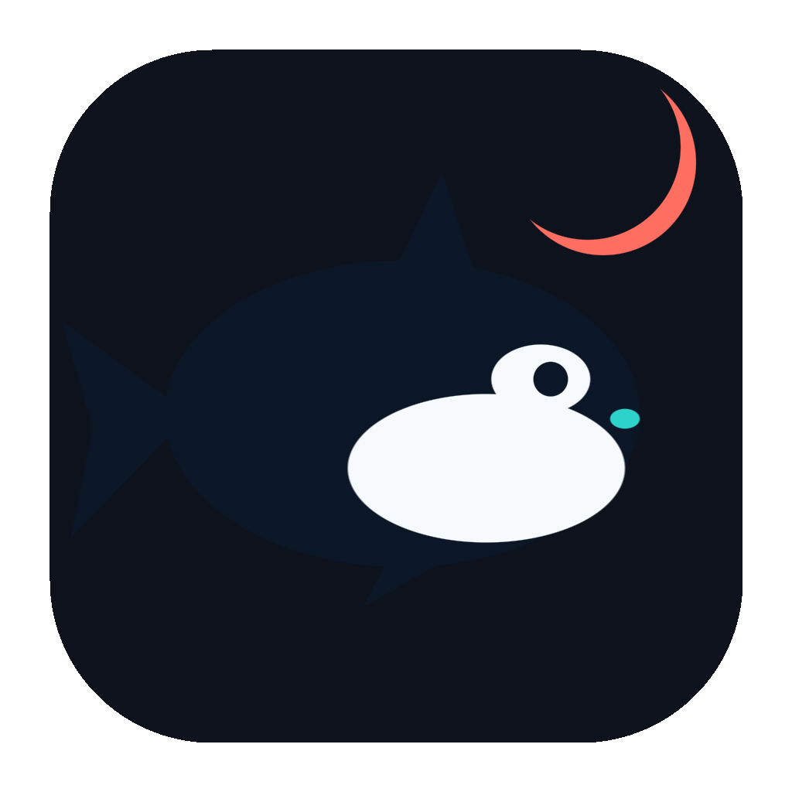
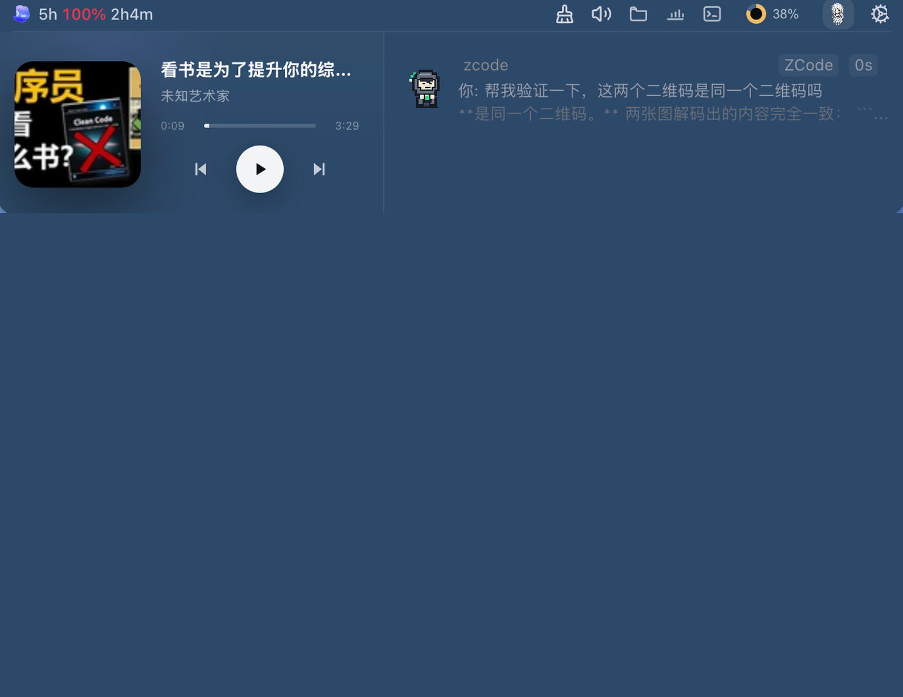

<p align="center">
  <a href="README.md">🇨🇳 中文</a> ·
  <a href="README_EN.md">🇺🇸 English</a>
</p>

<p align="center">
  
</p>

<h1 align="center">WorkIsland</h1>

<p align="center"><strong>工作需要你时，不必四处寻找。</strong></p>

<p align="center">
  一款面向 AI 原生工作流的本地优先 macOS 工作界面。从 Claude Code、Codex、Cursor 等编程 Agent 开始，把审批、提问、完成与回源变成有上下文、可处理的原生交互。
</p>

<p align="center">
  <a href="https://workisland.yanglaishe.cn/">官网</a> ·
  <a href="https://workisland.yanglaishe.cn/guide/">产品手册</a> ·
  <a href="https://workisland.yanglaishe.cn/changelog/">更新日志</a> ·
  <a href="https://github.com/qianzhu18/workisland/releases">下载</a> ·
  <a href="https://github.com/qianzhu18/workisland/issues/new/choose">反馈</a>
</p>

<p align="center">
  
  <a href="LICENSE"></a>
  <a href="https://workisland.yanglaishe.cn/"></a>
</p>



## 为什么需要 WorkIsland

WorkIsland 的产品定义是：**AI 原生时代的 macOS 工作界面**。它不替代 Agent、终端或其他工作应用；它让工作发生在原来的地方，并在需要你参与时提供状态、上下文和下一步。

当前公开版本从 AI 编程 Agent 开始：当多个任务在后台运行时，真正耗成本的不是启动它们，而是及时发现需要你拍板的那一个，再找回对应的终端或 IDE 会话。WorkIsland 把这一闭环收拢到同一个本地 macOS 界面里。

邮件、日历和通用通知是可探索的未来信号源，不是当前公开版本已交付或承诺的功能。

## 安装

**普通用户：** 从 [GitHub Releases](https://github.com/qianzhu18/workisland/releases) 下载 Apple Silicon DMG，无需任何云端账号。

> **版本叙事**：0.2.x 为内测期，1.x 为公开稳定线。WorkIsland 于 2026-08 基于两代原型经验重写。
>
> **关于 Windows**：Windows 支持暂停维护（代码、CI 与构建脚本完整保留）。当前没有达到我们质量标准的 Windows 版本，因此不提供公开下载。如果你日常使用 Windows 并愿意主导适配，欢迎[开 issue](https://github.com/qianzhu18/workisland/issues/new/choose) 联系我们。

**贡献者：** WorkIsland 需要一台 Apple Silicon Mac（参与 Windows 适配的贡献者可用 Windows 11 x64 设备），以及 Node.js 22 及以上版本。

```bash
git clone https://github.com/qianzhu18/workisland.git
cd workisland
npm run setup
npm run dev:isolated
```

只有当你确实想让应用连接你本地的真实 Agent Hook 配置时，才使用 `npm run dev`。隔离模式会把开发数据保留在仓库内部。

Windows 适配贡献者可使用 `npm run package:win` 构建安装版与便携版 EXE（当前不作为公开产物发布）。

## 你能做什么

- **看清关键状态**——运行中、待审批、待回答、已完成、已失败的任务，始终显示在 macOS 刘海附近。
- **就地处理审批与提问**——Agent 需要决策时直接回复，不必挨个终端轮询。
- **回到正确的源会话**——一键跳回对应的 Terminal、iTerm2、Ghostty、Warp、Cursor 或 VS Code 会话。
- **展开本地工作台**——媒体与歌词、性能进程、Shelf、私有剪贴板和持久化终端。
- **双本地信号监控**——Hooks 与转录文件监听互为补充，单一通道不可用时仍能观察任务完成情况。
- **本地优先的工作流**——任务内容只留在当前设备，监控本地工作无需云端账号。
- **通知贴合你的注意力**——自由选择灵动岛、桌面伴侣、声音、快捷键与通知时机，适配你的工作节奏。
- **让智能体理解 WorkIsland**——可选开启本地 MCP，让 Codex 解释产品功能、查询 WorkIsland 已观察到的任务状态、诊断常见问题；明确要求的设置修改可见、可撤销。

## MCP

在「设置 → MCP」中开启 MCP 服务并一键连接 Codex。连接后可以询问“灵动岛有哪些扩展功能”“现在有没有智能体在等我处理”，或让智能体诊断某个模块为什么没有显示。WorkIsland 只开放专门设计的脱敏工具，不提供任意命令执行、审批代办或会话内容读取；关闭开关后下一次调用立即失效。配置方法、完整工具清单、CLI、隐私边界和移除步骤见 [MCP 产品助手说明](docs/local-agent-control.md)。

## Agent 兼容性

WorkIsland 为以下 Agent 提供官方原生适配：Claude Code、Codex、Coco、Cursor、TraeCode、ZCode、WorkBuddy / CodeBuddy、OpenCode、Sara、Kimi Code、Gemini CLI、GitHub Copilot CLI、Hermes、Aiden、DeepSeek Harness 与 TRAE CLI。MiMo、Trae Work、Trae CN 以及通用的自定义 Hook 连接暂未列出，因为它们尚未通过真实端到端集成测试。TraeCode 需在应用内开启 Hooks 开关与本地自动执行模式后，事件才能送达 WorkIsland。

Windows 适配处于暂停维护状态，代码与构建入口完整保留，欢迎社区贡献者参与。

## 产品链接

| 资源 | 用途 |
| --- | --- |
| [WorkIsland 官网](https://workisland.yanglaishe.cn/) | 产品概览、真实界面与最新下载入口 |
| [产品手册](https://workisland.yanglaishe.cn/guide/) | 安装、首个 Agent 任务、隐私与反馈说明 |
| [AI 自定义接口手册](docs/AI-CUSTOMIZATION.md) | 让本机 AI Agent 自定义灵动岛背景与桌宠角色 |
| [更新日志](https://workisland.yanglaishe.cn/changelog/) | 查看每个版本的功能、修复和体验变化 |
| [GitHub Releases](https://github.com/qianzhu18/workisland/releases) | Apple Silicon DMG 与版本说明 |
| [GitHub Issues](https://github.com/qianzhu18/workisland/issues/new/choose) | Bug 报告与可公开讨论的建议 |
| [安全策略](SECURITY.md) | 安全问题的私下报告方式 |

## 隐私

WorkIsland 为本地工作流而设计，不会上传 Agent 会话、项目文件或终端内容。已安装的版本会检查 GitHub Releases 以获知更新。匿名使用遥测默认开启，已在「设置 → 关于」中披露，可随时关闭；关闭后会立即清除尚未发送的事件。完整事件白名单与隐私保障请参阅 [遥测说明](docs/TELEMETRY.md)。

## 社区与支持

若遇到可复现的 Bug，请提交 [GitHub Issue](https://github.com/qianzhu18/workisland/issues/new/choose)。如需反馈、咨询兼容性，或更新二维码，请发邮件至 [its.qianzhu@gmail.com](mailto:its.qianzhu@gmail.com?subject=WorkIsland%20feedback)。

<table>
  <tr>
    <td align="center" width="33%">
      <br>
      <strong>联系作者：千逐</strong><br>
      扫码添加微信，请备注 “WorkIsland”
    </td>
    <td align="center" width="33%">
      <br>
      <strong>加入 WorkIsland 社区</strong><br>
      扫码参与下一版讨论与 Agent 兼容性反馈
    </td>
    <td align="center" width="33%">
      <a href="https://workisland.yanglaishe.cn/#support">官网反馈与社区入口</a><br><br>
      你决定是否导出日志或截图。公开反馈前请先移除项目代码、密钥和其他敏感信息。
    </td>
  </tr>
</table>

## 支持项目

WorkIsland 免费且开源，没有订阅或内购。如果它帮你省下了一次上下文切换，你可以用微信支付 **请作者喝杯咖啡**。这是自愿支持，并非购买功能或优先支持。

<p align="center">
  
</p>

## 构建、贡献与发布

提交改动前，请先运行完整的本地检查：

```bash
npm run check
```

贡献规范请参阅 [CONTRIBUTING.md](CONTRIBUTING.md)，已签名、已公证的 macOS 发布流程请参阅 [docs/RELEASE_PROCESS.md](docs/RELEASE_PROCESS.md)。

## 许可证与商标

源代码基于 [Apache License 2.0](LICENSE) 许可。WorkIsland 的名称、商标与标识不在该许可范围内授权。第三方依赖、图片、字体、音频及配套素材各自保留其许可；详见 [NOTICE](NOTICE) 与 [THIRD_PARTY_NOTICES.md](THIRD_PARTY_NOTICES.md)。

---

如果 WorkIsland 帮到了你的 AI 编程工作流，点一个 GitHub Star 能让下一个人更容易发现这个项目。
